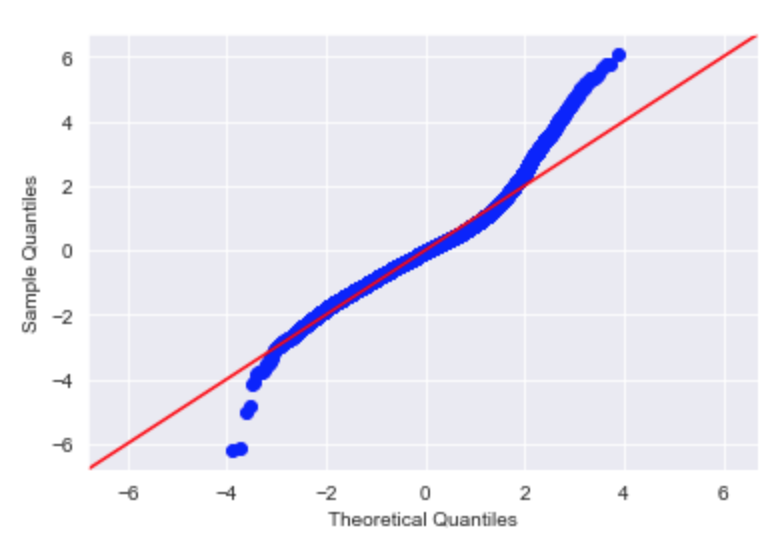

# Investigating King County Property Prices 

**Author:** Jack Mannix

## Summary 

A linear regression model trained to predict the price of properties throughout  King County, WA reveals the influence of many property characteristics 

## Business Problem 

King Property Services (KPS)  wants to acquire new properties that will appeal to recent college graduates / young professionals, and to better understand how different property characteristics influence the prices of properties that would appeal to this target demographic 

## Data and Methods 

This model was built from 20,647 King County properties  
- Data regarding cities corresponding to zipcodes taken from King County Open Data Source (LINK)
- Model = OLS Regression 

**Assumptions**
- Maximum property price = $1,350,000
- Bedrooms < 8  
- Bathrooms >=  ¾ Bath

---------------------------------------------------------------

# Process 

## Data Cleaning 

- Null / filler values filled with existing distributions 
    - 'waterfront'
    - 'yr_renovated'
    - 'sqft_basement'

- Duplicated 'id' enteries were assumed to be properties sold more than once
    - First instances of the duplicates were dropped so as to only analyze most recent sale of properties 
    
- Convered 'date' column to datetime

## EDA

- Determined most / least expensive cities 
    -40% of properties are located in Seattle 

 

- Bedrooms VS. Price
    - After 6 bedrooms the relationship between bedrooms and price becomes more complicated
    - Having 7, 8, or 11 bedrooms had a lower median price than properties with 6 bedrooms 

## Modeling 

### Baseline 

Steps taken to create baseline:
- Cleaning:
    - See 'Data Cleaning' Above
    - Data not yet filtered by assumptions 
- Dropped Features:
    - sqft_above
    - sqft_living15
- Created Features:
    - rel_living - difference between sqft_living and sqft_living15

R² = 0.698
Train RMSE: 197875.38
Test RMSE: 211117.17

**Interpretation**
- All feature p-values are well below 0.05
- Many features have negative coefficients (most of which are counterintuitive) 
    - bedrooms
    - sqft_basement
    - sqft_lot15
    - rel_living

Extreme residual values show that there are still many significant outliers within the data 

### Final Model 
The final model was achieved after four optimized iterations of the baseline model 

**Steps taken to create final model**
- Cleaning: 
    - Assumptions taken into consideration
        - Max price =< 1,350,000
        - Number of Bedrooms < 8
        - Number of Bathrooms > 0.5
    - Removed the single data point with a grade of 3
- Dummy Variables:
    - city
    - grade
    - view
- Added Features:
    - 24 unique cities corresponding to zipcodes  
- Dropped Features:
    - id
    - lat
    - long
    - zipcode
    - condition
    - ENUMCLAW
    - sqft_lot15

**Model Discussion**

After four iterations, my model contains 40 features. With many features, my attention falls upon the Adjusted R² = 0.729, rather than the R² = 0.730 (small as the difference may be). With a minimum threshold of R² = 0.6, a model that attributes 72.9% of the change in property price to the 40 examined features. Of these features, all have a p-value below 0.05 (the largest being Kent = 0.011), indicating there is a less than 5% for each feature's coefficent being due to randomness. While the summary does not display the actual Prob(F-statistic) (due to its very small value), we know that it is less than 1%. This statistic gives weight to the validity of the model, as it implies that some of the parameters are nonzero values (rejecting the null hpyothesis, that all parameters are 0).

An important parameter to note is the coefficient of bedrooms (-$11,990). While one would expect the price of a property to increase as the number of bedrooms increases, this is not the case according to this data. While there is a chance this may be a novel phenomenon to properties in King County, it is significant grounds to further examination with more data.

Another interesting parameter with a negative coefficient is yr_built (-$2,053.08). This informs us that for every year closer to the present date that a house was built (2015 for this data), the price drops $2,053.08. This is not as confounding as bedrooms having a negative coefficient, as it is very possible that older houses are worth more due to a variety of reasons (historical significance, style of architecture, etc.).

SUMMARY 

Train MSE: 127489.30825362197 
Test MSE: 126359.06534600414 

---------------------------------------------------------------

# Going Forward

## Reccomendations 
With the insight the model has given regarding the relationship between price and a variety of property characteristics, King Property Services should consider the following while trying to accomodate the budget restrictions and lifestyles of recent graduates:

- Properties with newer homes 
- Grade 7 properties 
- Properties with lesser views (1 or 2 out of 4)
- Properties without waterfront status
- Properties not in Medina, Mercer Island, and Bellevue

## Further Investigation 

- Conduct further analysis regarding the relationship between bedrooms and property price 
- Research age demographics by city / other geographical data
    - Young professionals tend to move to areas with a population with a similar age
- Explore how log transformations affect the performance of the model 

